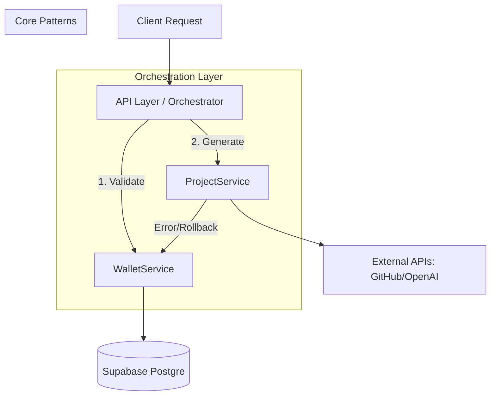

# WuzzKang Architecture
WuzzKang is a modular monolith SaaS platform designed for high-concurrency AI-generated landing page deployment.

## 1. High-Level System Architecture
The system relies on an "Orchestration" layer to ensure financial safety and deployment reliability.

## 2. Core Architectural Patterns
* **C. Adapter Pattern (Extensibility & Environment Switching):**
  - Providers implement `PaymentGatewayInterface`.
  - `PaymentFactory` acts as the Service Locator.
  - Logic: 
    - `DummyProvider`: Returns hardcoded success; used for local development and integration tests.
    - `WinpayProvider`: Uses RSA-SHA256 signing; used in production.
  - Signing Strategy: 
    - Winpay requests require RSA signing (Private Key).
    - Winpay callbacks require RSA verification (Public Key).

## 3. Tech Stack

| Layer | Technology |
| --- | --- |
| **Backend** | Node.js (TypeScript) |
| **Database** | Supabase (PostgreSQL + RLS) |
| **Async** | Redis + BullMQ |
| **Deployment** | Docker / Linux (VPS) |

## 4. API Strategy

* **Communication:** RESTful APIs for all internal and external communication.
* **Validation:** Zod schemas are mandatory for all input payloads (Request Bodies, Query Params).
* **Error Handling:** Standardized error responses (4xx for Client, 5xx for Server) with clear error codes.

## 5. Security & Authentication

* **Authentication:** Supabase Auth (JWT-based).
* **Authorization:** Row Level Security (RLS) is enabled on all tables.
* **Data Protection:** No hardcoded secrets; use `process.env`.
* **Rate Limiting:** Implemented at the API Gateway/Controller level to prevent abuse of the AI generation endpoint.

## 6. Orchestration Logic (Financial Safety)

To prevent balance leakage:

1. **Validate:** Check User Balance in `profiles`.
2. **Deduct:** Call `WalletService.deductBalance` (Atomic).
3. **Execute:** Run `ProjectService` generation.
4. **Finalize/Rollback:**
* If success: Commit transaction.
* If fail: Issue a refund transaction in `WalletService` to return 10.000 credits to user.
